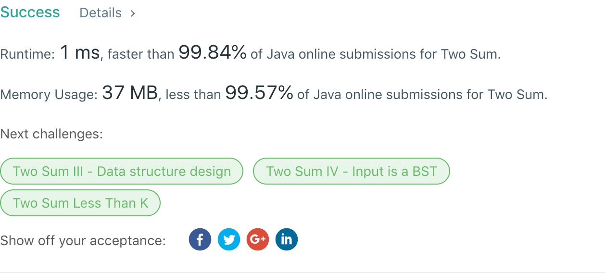

## 1. Two Sum

## 题目地址
https://leetcode.com/problems/two-sum/

## 题目描述
```

Given an array of integers, return indices of the two numbers such that they add up to a specific target.

You may assume that each input would have exactly one solution, and you may not use the same element twice.

Example:

Given nums = [2, 7, 11, 15], target = 9,

Because nums[0] + nums[1] = 2 + 7 = 9,
return [0, 1].
```


## 代码
* 语言支持：Java

```java
class Solution {
    public int[] twoSum(int[] nums, int target) {
        int[] clone = new int[nums.length];
		System.arraycopy(nums, 0, clone, 0, nums.length);
		Arrays.sort(nums);
		for(int i = 0, j = nums.length - 1; true;) {
			if(nums[i] + nums[j] > target) {
				--j;
			} else if(nums[i] + nums[j] == target) {
				int m = 0;
				for(; clone[m] != nums[i]; ++m);
				int n = 0;
				for(; m == n || clone[n] != nums[j]; ++n);
				if(m < n)
					return new int[] {m, n};
				return new int[] {n, m};
			} else {
				i++;
			}
		}
    }
}
```
