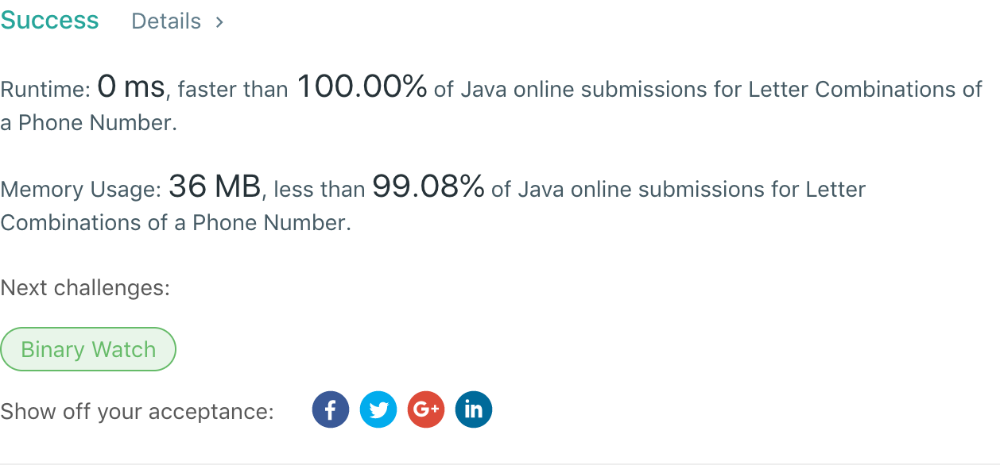

## 17. Letter Combinations of a Phone Number

## 题目地址
https://leetcode.com/problems/letter-combinations-of-a-phone-number/

## 题目描述
```

Given a string containing digits from 2-9 inclusive, return all possible letter combinations that the number could represent.

A mapping of digit to letters (just like on the telephone buttons) is given below. Note that 1 does not map to any letters.


Example:

Input: "23"
Output: ["ad", "ae", "af", "bd", "be", "bf", "cd", "ce", "cf"].
Note:

Although the above answer is in lexicographical order, your answer could be in any order you want.
```


## 代码
* 语言支持：Java

```java
public class Solution {
    public List<String> letterCombinations(String digits) {
        char[] digitChars = digits.toCharArray();
        if(digitChars.length == 0)
        	return Collections.emptyList();
        char[][] matrix = new char[digitChars.length][];
        for(int i = 0; i < digitChars.length; i++) {
			switch(digits.charAt(i)) {
			case '2':
				matrix[i] = new char[] {'a','b','c'};
				break;
			case '3':
				matrix[i] = new char[] {'d','e','f'};
				break;
			case '4':
				matrix[i] = new char[] {'g','h','i'};
				break;
			case '5':
				matrix[i] = new char[] {'j','k','l'};
				break;
			case '6':
				matrix[i] = new char[] {'m','n','o'};
				break;
			case '7':
				matrix[i] = new char[] {'p','q','r','s'};
				break;
			case '8':
				matrix[i] = new char[] {'t','u','v'};
				break;
			case '9':
				matrix[i] = new char[] {'w','x','y','z'};
				break;
			}
		}
        char[] solution = new char[digitChars.length];
        List<String> solutions = new ArrayList<>();
        backtracking(0, matrix, solution, solutions);
        return solutions;
    }
	
	private void backtracking(int currentIndex, char[][] matrix, char[] solution, List<String> solutions) {
		if(currentIndex == matrix.length) {
			addResult(solution, solutions);
		} else {
			for(int i = 0; i < matrix[currentIndex].length; i++) {
				solution[currentIndex] = matrix[currentIndex][i];
				backtracking(currentIndex+1, matrix, solution, solutions);
			}
		}
	}
	
	private void addResult(char[] solution, List<String> solutions) {
		solutions.add(new String(solution));
	}
}
```
