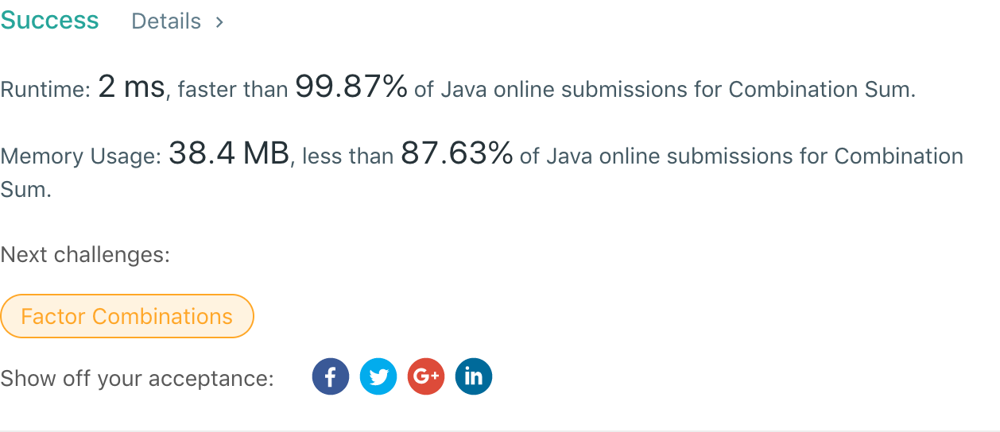

## 39. Combination Sum

## 题目地址
https://leetcode.com/problems/combination-sum/

## 题目描述
```

Given a set of candidate numbers (candidates) (without duplicates) and a target number (target), find all unique combinations in candidates where the candidate numbers sums to target.

The same repeated number may be chosen from candidates unlimited number of times.

Note:

All numbers (including target) will be positive integers.
The solution set must not contain duplicate combinations.
Example 1:

Input: candidates = [2,3,6,7], target = 7,
A solution set is:
[
  [7],
  [2,2,3]
]
Example 2:

Input: candidates = [2,3,5], target = 8,
A solution set is:
[
  [2,2,2,2],
  [2,3,3],
  [3,5]
]
```


## 代码
* 语言支持：Java

```java
public class Solution {
    List<List<Integer>> matrix = new ArrayList<>();
	List<Integer> row = new ArrayList<>();
	public List<List<Integer>> combinationSum(int[] candidates, int target) {
		Arrays.sort(candidates);
		backtracking(candidates, target, 0);
		return matrix;
    }
	
	private void backtracking(int[] candidates, int target, int index) {
		if(target == 0) {
			List<Integer> copy = new ArrayList<>(row);
			matrix.add(copy);
		} else {
			for(int i = index; i < candidates.length && candidates[i] <= target; i++) {
				row.add(candidates[i]);
				backtracking(candidates, target - candidates[i], i);
				row.remove(row.size() - 1);
			}
		}
	}
}
```
