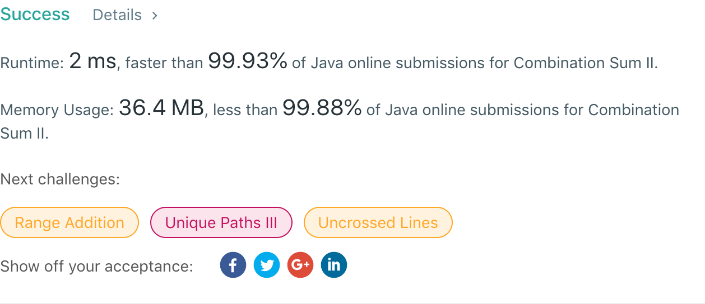

## 40. Combination Sum II

## 题目地址
https://leetcode.com/problems/combination-sum-ii/

## 题目描述
```

Given a collection of candidate numbers (candidates) and a target number (target), find all unique combinations in candidates where the candidate numbers sums to target.

Each number in candidates may only be used once in the combination.

Note:

All numbers (including target) will be positive integers.
The solution set must not contain duplicate combinations.
Example 1:

Input: candidates = [10,1,2,7,6,1,5], target = 8,
A solution set is:
[
  [1, 7],
  [1, 2, 5],
  [2, 6],
  [1, 1, 6]
]
Example 2:

Input: candidates = [2,5,2,1,2], target = 5,
A solution set is:
[
  [1,2,2],
  [5]
]
```


## 代码
* 语言支持：Java

```java
public class Solution {
    public List<List<Integer>> combinationSum2(int[] candidates, int target) {
        Arrays.sort(candidates);
        List<List<Integer>> matrix = new ArrayList<>();
        List<Integer> row = new ArrayList<Integer>();
        backtracking(candidates, target, 0, matrix, row);
        return matrix;
    }
    
    private void backtracking(int[] candidates, int target, int index, List<List<Integer>> matrix, List<Integer> row) {
        if(target == 0) {
            List<Integer> copy = new ArrayList<>(row);
            matrix.add(copy);
        } else {
            for(int i = index; i < candidates.length && candidates[i] <= target; i++) {
                if(i != index && candidates[i] == candidates[i-1]) continue;
                row.add(candidates[i]);
                backtracking(candidates, target - candidates[i], i + 1, matrix, row);
                row.remove(row.size() - 1);
            }
        }
    }
}
```
