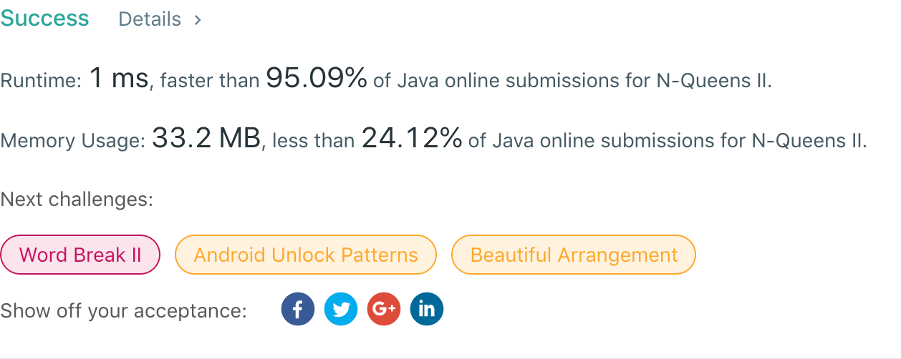

## 52. N-Queens II

## 题目地址
https://leetcode.com/problems/n-queens-ii/

## 题目描述
```

The n-queens puzzle is the problem of placing n queens on an n×n chessboard such that no two queens attack each other.


Given an integer n, return the number of distinct solutions to the n-queens puzzle.

Example:

Input: 4
Output: 2
Explanation: There are two distinct solutions to the 4-queens puzzle as shown below.
[
 [".Q..",  // Solution 1
  "...Q",
  "Q...",
  "..Q."],

 ["..Q.",  // Solution 2
  "Q...",
  "...Q",
  ".Q.."]
]
```


## 代码
* 语言支持：Java

```java
class Solution {
    int row;
    int col;
    long diagonal;
    long antiDiagonal;

    boolean isValid(int i, int j, int n) {
        return (row >> i & 1) == 0 && (col >> j & 1) == 0 && (diagonal >> (i + j) & 1) == 0 && (antiDiagonal >> (j - i + n - 1) & 1) == 0;
    }

    void setValue(int i, int j, int n) {
        row |= 1 << i;
        col |= 1 << j;
        diagonal |= 1 << i + j;
        antiDiagonal |= 1 << j - i + n - 1;
    }

    void unSetValue(int i, int j, int n) {
        row &= ~(1 << i);
        col &= ~(1 << j);
        diagonal &= ~(1 << i + j);
        antiDiagonal &= ~(1 << j - i + n - 1);
    }

    void backtracking(int n, int level) {
        if (level == n) {
            result++;
        } else {
            for (int j = 0; j < n; j++) {
                if (isValid(level, j, n)) {
                    setValue(level, j, n);
                    backtracking(n, level + 1);
                    unSetValue(level, j, n);
                }
            }
        }

    }
    int result;
    public int totalNQueens(int n) {
        backtracking(n, 0);
        return result;
    }
}
```
