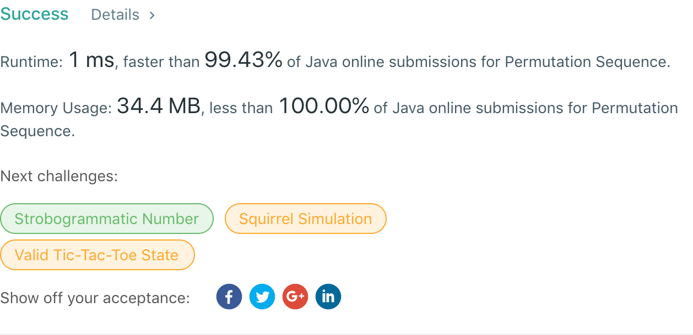

## 60. Permutation Sequence

## 题目地址
https://leetcode.com/problems/permutation-sequence/

## 题目描述
```

The set [1,2,3,...,n] contains a total of n! unique permutations.

By listing and labeling all of the permutations in order, we get the following sequence for n = 3:

"123"
"132"
"213"
"231"
"312"
"321"
Given n and k, return the kth permutation sequence.

Note:

Given n will be between 1 and 9 inclusive.
Given k will be between 1 and n! inclusive.
Example 1:

Input: n = 3, k = 3
Output: "213"
Example 2:

Input: n = 4, k = 9
Output: "2314"
```


## 代码
* 语言支持：Java

```java
public class Solution {
    public String getPermutation(int n, int k) {
		List<Integer> nums = new ArrayList<>();
		for(int i = 1; i <= n; i++)
			nums.add(i);

		int[] one = new int[1];
		backtracking(n, k, nums, one, 9, 362880);
		return one[0] + "";
    }
	
	private void backtracking(int n, int k, List<Integer> nums, int[] one, int current, int factorial) {
		if(current == 0) return;
		else {
			factorial /= current;
			if(n >= current) {
				int num = (k-1) / factorial;
				one[0] = one[0] * 10 + nums.remove(num);
				k -= num * factorial;
			}
			backtracking(n, k, nums, one, current - 1, factorial);
		}
	}
}
```
