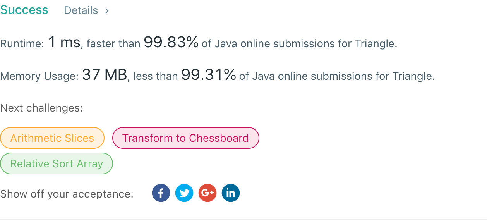

## 120. Triangle

## 题目地址
https://leetcode.com/problems/triangle/

## 题目描述
```
Given a triangle, find the minimum path sum from top to bottom. Each step you may move to adjacent numbers on the row below.

For example, given the following triangle

[
     [2],
    [3,4],
   [6,5,7],
  [4,1,8,3]
]
The minimum path sum from top to bottom is 11 (i.e., 2 + 3 + 5 + 1 = 11).

Note:

Bonus point if you are able to do this using only O(n) extra space, where n is the total number of rows in the triangle.
```


## 代码
* 语言支持：Java

```java
public class Solution {
    public int minimumTotal(List<List<Integer>> triangle) {
        int[] dp = new int[triangle.size()];
        int j = 0;
        List<Integer> lastRow = triangle.get(triangle.size() - 1);
        for(int i : lastRow)
            dp[j++] = i;
        return minimumTotal(triangle, dp, triangle.size() - 2);
    }

    public int minimumTotal(List<List<Integer>> triangle, int[] dp, int lvlidx) {
        if(lvlidx == -1) return dp[0];
        List<Integer> list = triangle.get(lvlidx);
        for (int i = 0; i <= lvlidx; i++) {
            dp[i] = list.get(i) + Math.min(dp[i], dp[i + 1]);
        }
        return minimumTotal(triangle, dp, lvlidx - 1);
    }
}
```
