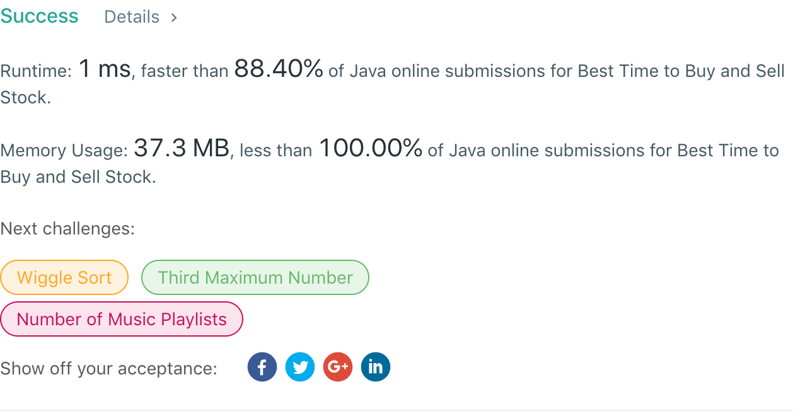

## 121. Best Time to Buy and Sell Stock

## 题目地址
https://leetcode.com/problems/best-time-to-buy-and-sell-stock/

## 题目描述
```
Say you have an array for which the ith element is the price of a given stock on day i.

If you were only permitted to complete at most one transaction (i.e., buy one and sell one share of the stock), design an algorithm to find the maximum profit.

Note that you cannot sell a stock before you buy one.

Example 1:

Input: [7,1,5,3,6,4]
Output: 5
Explanation: Buy on day 2 (price = 1) and sell on day 5 (price = 6), profit = 6-1 = 5.
             Not 7-1 = 6, as selling price needs to be larger than buying price.
Example 2:

Input: [7,6,4,3,1]
Output: 0
Explanation: In this case, no transaction is done, i.e. max profit = 0.
```


## 代码
* 语言支持：Java

```java
public class Solution {
    public int maxProfit(int[] prices) {
        if(prices.length == 0) return 0;
		int min = prices[prices.length - 1];
		int max = 0;
		for(int i = prices.length - 2; i >= 0; i--) {
			if(prices[i] >= min)
				min = prices[i];
			else
				max = Math.max(max, min - prices[i]);
		}
        return max;
    }
}
```
