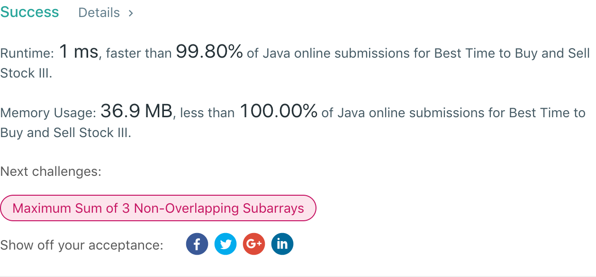

## 123. Best Time to Buy and Sell Stock III

## 题目地址
https://leetcode.com/problems/best-time-to-buy-and-sell-stock-iii/

## 题目描述
```
Say you have an array for which the ith element is the price of a given stock on day i.

Design an algorithm to find the maximum profit. You may complete at most two transactions.

Note: You may not engage in multiple transactions at the same time (i.e., you must sell the stock before you buy again).

Example 1:

Input: [3,3,5,0,0,3,1,4]
Output: 6
Explanation: Buy on day 4 (price = 0) and sell on day 6 (price = 3), profit = 3-0 = 3.
             Then buy on day 7 (price = 1) and sell on day 8 (price = 4), profit = 4-1 = 3.
Example 2:

Input: [1,2,3,4,5]
Output: 4
Explanation: Buy on day 1 (price = 1) and sell on day 5 (price = 5), profit = 5-1 = 4.
             Note that you cannot buy on day 1, buy on day 2 and sell them later, as you are
             engaging multiple transactions at the same time. You must sell before buying again.
Example 3:

Input: [7,6,4,3,1]
Output: 0
Explanation: In this case, no transaction is done, i.e. max profit = 0.
```


## 代码
* 语言支持：Java

```java
public class Solution {
    public int maxProfit(int[] prices) {
		if(prices.length == 0) return 0;
		int[] left = new int[prices.length];
		int min = prices[0];
		for(int i = 1; i < prices.length; i++) {
			if(prices[i] < min) {
				min = prices[i];
				left[i] = left[i-1];
			} else {
				left[i] = Math.max(left[i-1], prices[i] - min);
			}
		}
		int max = prices[prices.length - 1];
		prices[prices.length - 1] = 0;
		for(int i = prices.length - 2; i >= 0; i--) {
			if(prices[i] > max) {
				max = prices[i];
				prices[i] = prices[i+1];
			} else {
				prices[i] = Math.max(prices[i+1], max - prices[i]);
			}
		}
		max = 0;
		for(int i = 0; i < prices.length; i++) {
			max = Math.max(left[i] + prices[i], max);
		}
		return max;
    }
}
```
