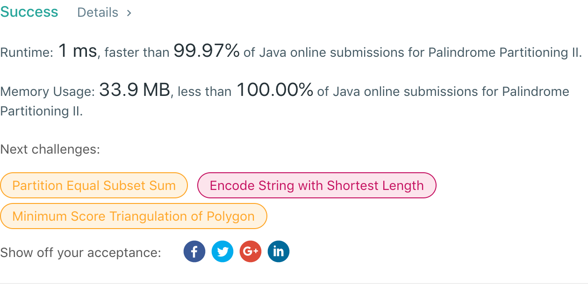

## 132. Palindrome Partitioning II

## 题目地址
https://leetcode.com/problems/palindrome-partitioning-ii/

## 题目描述
```
Given a string s, partition s such that every substring of the partition is a palindrome.

Return the minimum cuts needed for a palindrome partitioning of s.

Example:

Input: "aab"
Output: 1
Explanation: The palindrome partitioning ["aa","b"] could be produced using 1 cut.
```


## 代码
* 语言支持：Java

```java
class Solution {
    public int[] longestPalindrome(char[] array, int left, int right) {
        if(left == right)
            return new int[] {left, right};
        int a, b;
        int max = 1;
        int maxIndex = (left + right) / 2;
        int model = 1;
        for(int mid = (left + right) / 2, i = 1; mid + 1 >= left + max && mid <= right + 1 - max; i++) {
            a = 1;
            b = 0;
            for(; a <= mid && a < right + 1 - mid && array[mid - a] == array[mid + a]; a++);
            if(a > max) {
                maxIndex = mid;
                model = 1;
                max = a;
            }
            for(; b <= mid && b < right - mid && array[mid - b] == array[mid + 1 + b]; b++);
            if(b >= max) {
                maxIndex = mid;
                model = 3;
                max = b;
            }
            mid = mid >= (left + right) / 2 ? mid - i : mid + i;
        }
        return new int[] {maxIndex - max + (model & 1), maxIndex + max + (model >> 1 & 1) - 1};
    }

    int backtracking(char[] chars, int left, int right) {
        int[] result = longestPalindrome(chars, left, right);
        if(result[0] == left && result[1] == right) return 0;
        int cuts = 0;
        if(result[0] > left) {
            cuts += backtracking(chars, left, result[0] - 1) + 1;
        }
        if(result[1] < right) {
            cuts += backtracking(chars, result[1] + 1, right) + 1;
        }
        return cuts;
    }
    public int minCut(String s) {
        char[] chars = s.toCharArray();
        int length = chars.length;
        return backtracking(chars, 0, length - 1);
    }
}
```
