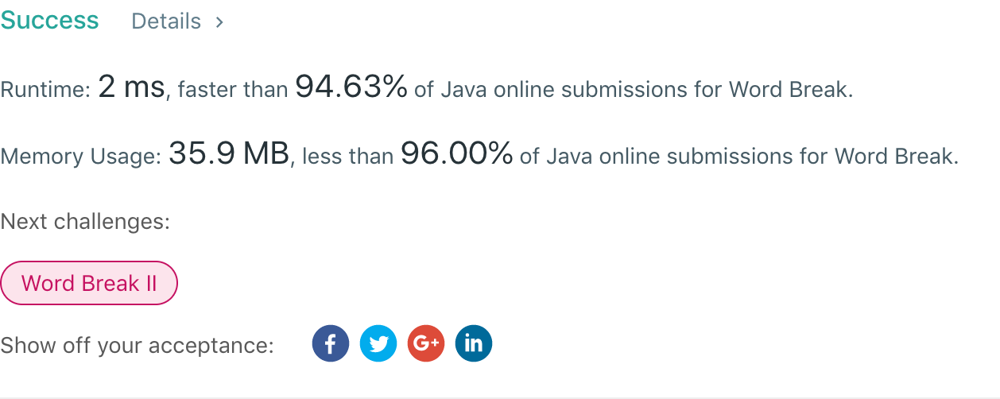

## 139. Word Break

## 题目地址
https://leetcode.com/problems/word-break/

## 题目描述
```
Given a non-empty string s and a dictionary wordDict containing a list of non-empty words, determine if s can be segmented into a space-separated sequence of one or more dictionary words.

Note:

The same word in the dictionary may be reused multiple times in the segmentation.
You may assume the dictionary does not contain duplicate words.
Example 1:

Input: s = "leetcode", wordDict = ["leet", "code"]
Output: true
Explanation: Return true because "leetcode" can be segmented as "leet code".
Example 2:

Input: s = "applepenapple", wordDict = ["apple", "pen"]
Output: true
Explanation: Return true because "applepenapple" can be segmented as "apple pen apple".
             Note that you are allowed to reuse a dictionary word.
Example 3:

Input: s = "catsandog", wordDict = ["cats", "dog", "sand", "and", "cat"]
Output: false
```


## 代码
* 语言支持：Java

```java
class Solution {
    boolean backtracking(int[][] matrix, int i, int length) {
        if(i == length)
            return true;
        for(int k = i; k < length; k++) {
            if(matrix[i][k] == 1) {
                if(backtracking(matrix, k + 1, length))
                    return true;
                matrix[i][k] = -1;
            }
        }
        return false;

    }
    public boolean wordBreak(String s, List<String> wordDict) {
        int length = s.length();
        int[][] matrix = new int[length][length];
        for(String word : wordDict) {
            int wordSize = word.length() - 1;
            for(int index = s.indexOf(word, 0); index != -1; index = s.indexOf(word, index+1)) {
                matrix[index][index + wordSize] = 1;
            }
        }
        int i = 0;
        for(; i < length && matrix[0][i] == 0; i++);
        if(i == length) return false;
        for(i = 0; i < length && matrix[i][length - 1] == 0; i++);
        if(i == length) return false;
        return backtracking(matrix, 0, length);
    }
}
```
