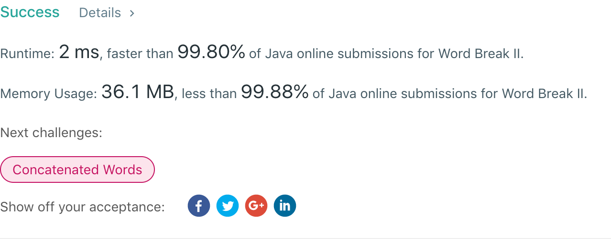

## 140. Word Break II

## 题目地址
https://leetcode.com/problems/word-break-ii/

## 题目描述
```
Given a non-empty string s and a dictionary wordDict containing a list of non-empty words, add spaces in s to construct a sentence where each word is a valid dictionary word. Return all such possible sentences.

Note:

The same word in the dictionary may be reused multiple times in the segmentation.
You may assume the dictionary does not contain duplicate words.
Example 1:

Input:
s = "catsanddog"
wordDict = ["cat", "cats", "and", "sand", "dog"]
Output:
[
  "cats and dog",
  "cat sand dog"
]
Example 2:

Input:
s = "pineapplepenapple"
wordDict = ["apple", "pen", "applepen", "pine", "pineapple"]
Output:
[
  "pine apple pen apple",
  "pineapple pen apple",
  "pine applepen apple"
]
Explanation: Note that you are allowed to reuse a dictionary word.
Example 3:

Input:
s = "catsandog"
wordDict = ["cats", "dog", "sand", "and", "cat"]
Output:
[]
```


## 代码
* 语言支持：Java

```java
class Solution {
    boolean backtracking(int[][] matrix, int i, int length, StringBuilder sb, String s) {
        if(i == length) {
            result.add(sb.substring(0, sb.length() - 1));
            return true;
        }
        boolean flag = false;
        int k = i;
        for(; k < length; k++) {
            if(matrix[i][k] == 1) {
                sb.append(s, i, k + 1).append(' ');
                if(!backtracking(matrix, k + 1, length, sb, s))
                    matrix[i][k] = -1;
                else
                    flag = true;
                sb.delete(sb.length() + i - k - 2, sb.length());
            }
        }
        return flag;
    }
    List<String> result = new ArrayList<>();
    public List<String> wordBreak(String s, List<String> wordDict) {
        int length = s.length();
        int[][] matrix = new int[length][length];
        for(String word : wordDict) {
            int wordSize = word.length() - 1;
            for(int index = s.indexOf(word, 0); index != -1; index = s.indexOf(word, index+1)) {
                matrix[index][index + wordSize] = 1;
            }
        }
        int i = 0;
        for(; i < length && matrix[0][i] == 0; i++);
        if(i == length) return result;
        for(i = 0; i < length && matrix[i][length - 1] == 0; i++);
        if(i == length) return result;
        backtracking(matrix, 0, length, new StringBuilder(), s);
        return result;
    }
}
```
