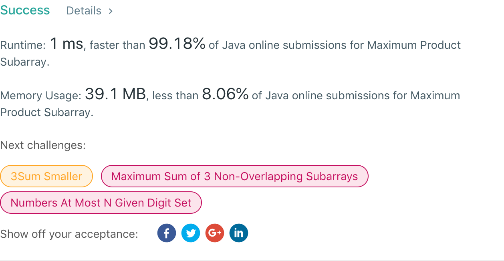

## 152. Maximum Product Subarray

## 题目地址
https://leetcode.com/problems/maximum-product-subarray/

## 题目描述
```
Given an integer array nums, find the contiguous subarray within an array (containing at least one number) which has the largest product.

Example 1:

Input: [2,3,-2,4]
Output: 6
Explanation: [2,3] has the largest product 6.
Example 2:

Input: [-2,0,-1]
Output: 0
Explanation: The result cannot be 2, because [-2,-1] is not a subarray.
```


## 代码
* 语言支持：Java

```java
class Solution {
    public int maxProduct(int[] nums) {
        int max = nums[0], min = nums[0], result = nums[0];
        for (int i = 1; i < nums.length; i++) {
            if (nums[i] > 0) {
                if (max <= 0)
                    max = nums[i];
                else
                    max *= nums[i];
                if (min >= 0)
                    min = nums[i];
                else
                    min *= nums[i];
            } else {
                int temp = max;
                if (min >= 0)
                    max = nums[i];
                else
                    max = min * nums[i];
                if (temp <= 0)
                    min = nums[i];
                else
                    min = temp * nums[i];
            }
            result = Math.max(max, result);
        }
        return result;
    }
}
```
