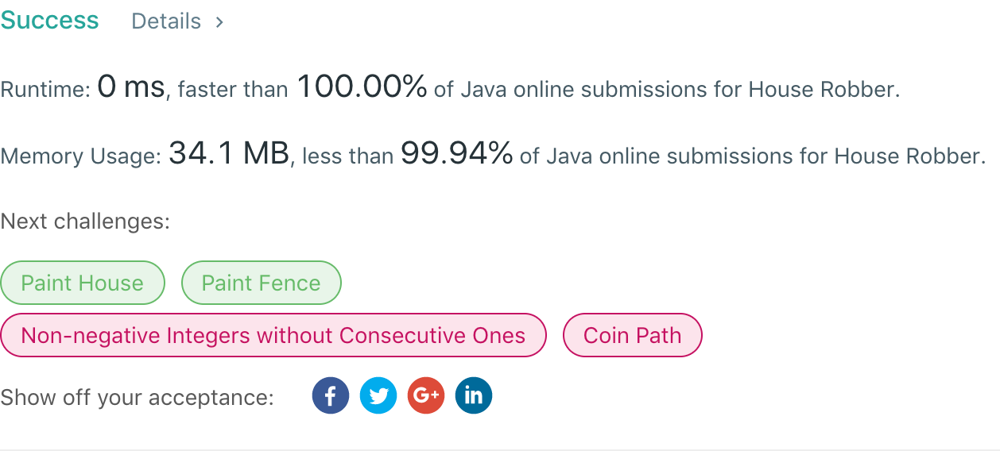

## 198. House Robber

## 题目地址
https://leetcode.com/problems/house-robber/

## 题目描述
```
You are a professional robber planning to rob houses along a street. Each house has a certain amount of money stashed, the only constraint stopping you from robbing each of them is that adjacent houses have security system connected and it will automatically contact the police if two adjacent houses were broken into on the same night.

Given a list of non-negative integers representing the amount of money of each house, determine the maximum amount of money you can rob tonight without alerting the police.

Example 1:

Input: [1,2,3,1]
Output: 4
Explanation: Rob house 1 (money = 1) and then rob house 3 (money = 3).
             Total amount you can rob = 1 + 3 = 4.
Example 2:

Input: [2,7,9,3,1]
Output: 12
Explanation: Rob house 1 (money = 2), rob house 3 (money = 9) and rob house 5 (money = 1).
             Total amount you can rob = 2 + 9 + 1 = 12.
```


## 代码
* 语言支持：Java

```java
public class Solution {
    public int rob(int[] nums) {
        if (nums.length == 0) return 0;
        for (int i = 1; i < nums.length; i++) {
            if(i > 1)
                nums[i] += nums[i-2];
            nums[i] = Math.max(nums[i - 1], nums[i]);
        }
        return nums[nums.length - 1];
    }
}
public class Solution {
    public int rob(int[] nums) {
        int length = nums.length;
		if(length == 0) return 0;
		if(length == 1) return nums[0];
		int[] max = new int[length];
		max[0] = nums[0];
		max[1] = nums[0] > nums[1] ? nums[0] : nums[1];
		for(int i = 2; i < length; i++) {
			max[i] = Math.max(max[i-1], max[i-2] + nums[i]);
		}
		return max[length - 1];
    }
}
public class Solution {
    public int rob(int[] nums) {
        int length = nums.length;
        if(length == 0) return 0;
        if(length == 1) return nums[0];
        int a = nums[0];
        int b = nums[0] > nums[1] ? nums[0] : nums[1];
        for(int i = 2; i < length; i++) {
            int tmp = b;
            b = Math.max(b, a + nums[i]);
            a = tmp;
        }
        return b;
    }
}
```
