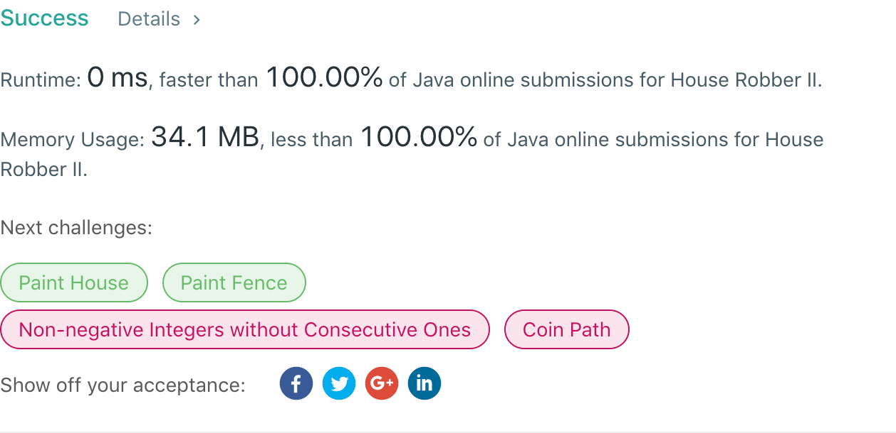

## 213. House Robber II

## 题目地址
https://leetcode.com/problems/house-robber-ii/

## 题目描述
```
You are a professional robber planning to rob houses along a street. Each house has a certain amount of money stashed. All houses at this place are arranged in a circle. That means the first house is the neighbor of the last one. Meanwhile, adjacent houses have security system connected and it will automatically contact the police if two adjacent houses were broken into on the same night.

Given a list of non-negative integers representing the amount of money of each house, determine the maximum amount of money you can rob tonight without alerting the police.

Example 1:

Input: [2,3,2]
Output: 3
Explanation: You cannot rob house 1 (money = 2) and then rob house 3 (money = 2),
             because they are adjacent houses.
Example 2:

Input: [1,2,3,1]
Output: 4
Explanation: Rob house 1 (money = 1) and then rob house 3 (money = 3).
             Total amount you can rob = 1 + 3 = 4.
```


## 代码
* 语言支持：Java

```java
public class Solution {
    public int rob(int[] nums) {
        int length = nums.length;
        if(length == 0) return 0;
        if(length == 1) return nums[0];
        // 从前往后开始打劫，截止到到倒数第二间
        int a = nums[0], b = Math.max(nums[0], nums[1]);
        for(int i = 2; i < length - 1; i++) {
            int tmp = b;
            b = Math.max(b, a + nums[i]);
            a = tmp;
        }
        int max = b;
        // 从后往前开始打劫，截止到第二间
        a = nums[nums.length - 1];
        b = Math.max(nums[nums.length - 2], nums[nums.length - 1]);
        for(int i = nums.length - 3; i > 0; i--) {
            int tmp = b;
            b = Math.max(b, a + nums[i]);
            a = tmp;
        }
        return Math.max(max, b);
    }
}
```
