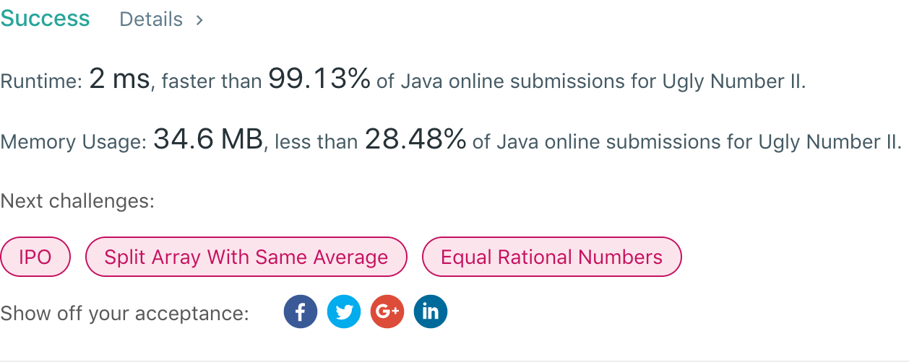

## 264. Ugly Number II

## 题目地址
https://leetcode.com/problems/ugly-number-ii/

## 题目描述
```
Write a program to find the n-th ugly number.

Ugly numbers are positive numbers whose prime factors only include 2, 3, 5. 

Example:

Input: n = 10
Output: 12
Explanation: 1, 2, 3, 4, 5, 6, 8, 9, 10, 12 is the sequence of the first 10 ugly numbers.
Note:  

1 is typically treated as an ugly number.
n does not exceed 1690.
```


## 代码
* 语言支持：Java

```java
public class Solution {
    public int nthUglyNumber(int n) {
        if(n == 1) return 1;
		int[] array = new int[n];
		int two = 0;
		int three = 0;
		int five = 0;
		array[0] = 1;
		int min = 0;
		int minIndex = 0;
		for(int i = 1; i < n; i++) {
			minIndex = 0;
			min = array[two] * 2;
			if(array[three] * 3 < min) {
				minIndex = 1;
				min = array[three] * 3;
			} else if(array[three] * 3 == min) {
				++three;
			}
			if(array[five] * 5 < min) {
				minIndex = 2;
				min = array[five] * 5;
			} else if(array[five] * 5 == min) {
				++five;
			}
			if(minIndex == 0) {
				two++;
			} else if(minIndex == 1) {
				three++;
			} else {
				five++;
			}
			array[i] = min;
		}
		return array[n-1];
    }
}
```
