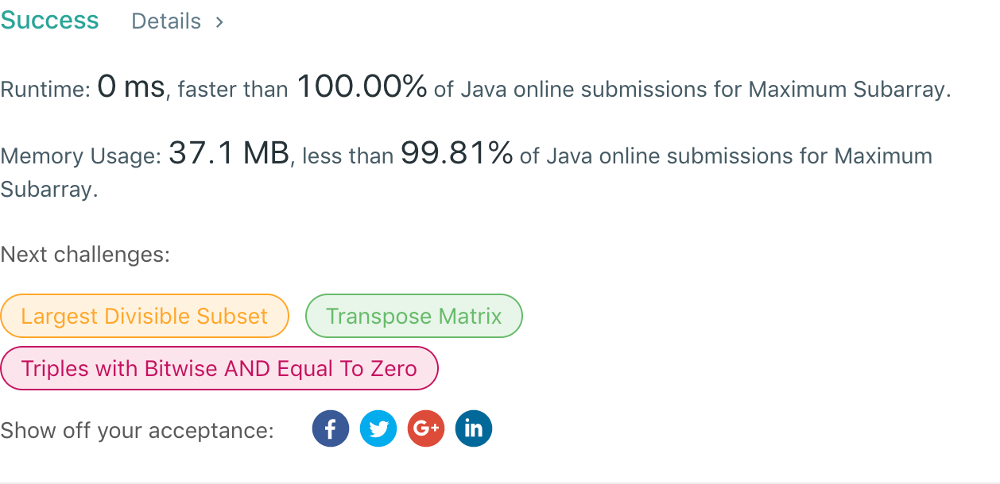

## 53. Maximum Subarray

## 题目地址
https://leetcode.com/problems/maximum-subarray/

## 题目描述
```
Given an integer array nums, find the contiguous subarray (containing at least one number) which has the largest sum and return its sum.

Example:

Input: [-2,1,-3,4,-1,2,1,-5,4],
Output: 6
Explanation: [4,-1,2,1] has the largest sum = 6.
Follow up:

If you have figured out the O(n) solution, try coding another solution using the divide and conquer approach, which is more subtle.
```


## 代码
* 语言支持：Java

```java
class Solution {
    public int maxSubArray(int[] nums) {
        if(nums.length == 0) return 0;
        int max = nums[0];
        for(int i = 1; i < nums.length; i++) {
            if(nums[i-1] > 0) {
                nums[i] += nums[i-1];
            }
            max = Math.max(max, nums[i]);
        }
        return max;
    }
}
```
