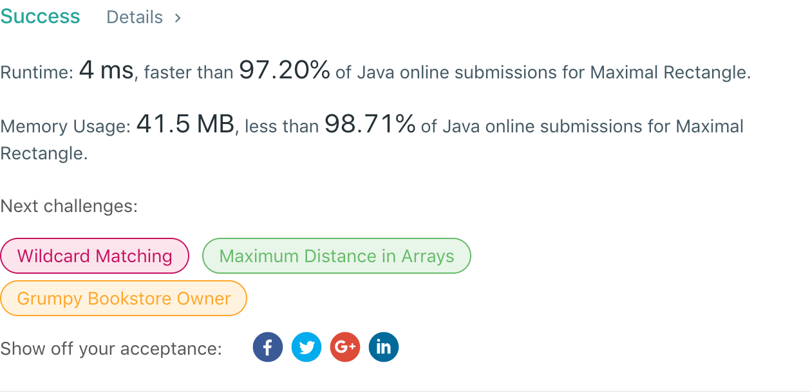

## 85. Maximal Rectangle

## 题目地址
https://leetcode.com/problems/maximal-rectangle/

## 题目描述
```
Given a 2D binary matrix filled with 0's and 1's, find the largest rectangle containing only 1's and return its area.

Example:

Input:
[
  ["1","0","1","0","0"],
  ["1","0","1","1","1"],
  ["1","1","1","1","1"],
  ["1","0","0","1","0"]
]
Output: 6
```


## 代码
* 语言支持：Java

```java
class Solution {
    public int largestRectangleArea(int[] heights) {
        int length = heights.length;
        if(length == 0) return 0;
        int[] lessFromLeft = new int[length];
        int[] lessFromRight = new int[length];
        lessFromLeft[0] = -1;
        lessFromRight[length - 1] = length;
        for(int i = 1; i < length; i++) {
            int j = i - 1;
            for(; j >= 0 && heights[i] <= heights[j]; j = lessFromLeft[j]);
            lessFromLeft[i] = j;
        }
        for(int i = length - 2; i >= 0; i--) {
            int j = i + 1;
            for(; j < length && heights[i] <= heights[j]; j = lessFromRight[j]);
            lessFromRight[i] = j;
        }
        int max = 0;
        for(int i = 0; i < length; i++)
            max = Math.max(max, (lessFromRight[i] - lessFromLeft[i] - 1) * heights[i]);
        return max;
    }
    public int maximalRectangle(char[][] matrix) {
        int length = matrix.length;
        if(length == 0) return 0;
        int[] height = new int[matrix[0].length];
        int max = 0;
        for(int i = 0; i < length; i++) {
            for(int j = 0; j < matrix[0].length; j++) {
                height[j] = matrix[i][j] == '0' ? 0 : height[j] + 1;
            }
            max = Math.max(max, largestRectangleArea(height));
        }
        return max;
    }
}
```
