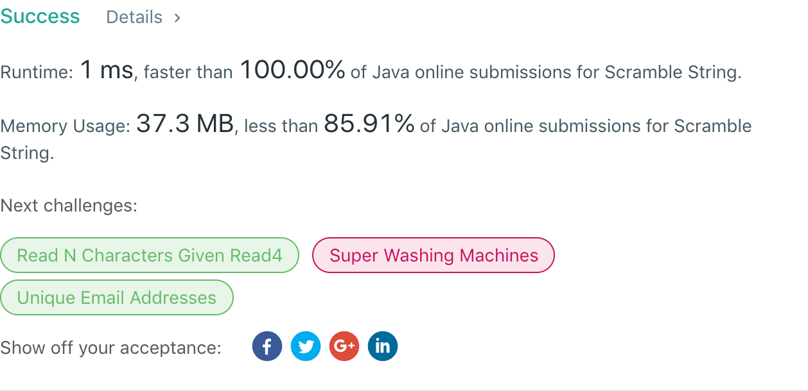

## 87. Scramble String

## 题目地址
https://leetcode.com/problems/scramble-string/

## 题目描述
```
Given a string s1, we may represent it as a binary tree by partitioning it to two non-empty substrings recursively.

Below is one possible representation of s1 = "great":

    great
   /    \
  gr    eat
 / \    /  \
g   r  e   at
           / \
          a   t
To scramble the string, we may choose any non-leaf node and swap its two children.

For example, if we choose the node "gr" and swap its two children, it produces a scrambled string "rgeat".

    rgeat
   /    \
  rg    eat
 / \    /  \
r   g  e   at
           / \
          a   t
We say that "rgeat" is a scrambled string of "great".

Similarly, if we continue to swap the children of nodes "eat" and "at", it produces a scrambled string "rgtae".

    rgtae
   /    \
  rg    tae
 / \    /  \
r   g  ta  e
       / \
      t   a
We say that "rgtae" is a scrambled string of "great".

Given two strings s1 and s2 of the same length, determine if s2 is a scrambled string of s1.

Example 1:

Input: s1 = "great", s2 = "rgeat"
Output: true
Example 2:

Input: s1 = "abcde", s2 = "caebd"
Output: false
```


## 代码
* 语言支持：Java

```java
class Solution {
    private boolean recursive(int l1, int r1, int l2, int r2) {
        if(l1 == r1 && c1[l1] == c2[l2]) return true;
        int[] array = new int[26];
        for (int i = l1; i <= r1; i++)
            array[c1[i] - 'a']++;
        for (int i = l2; i <= r2; i++)
            array[c2[i] - 'a']--;
        for (int i = 0; i < 26; i++)
            if (array[i] != 0)
                return false;
        for (int i = 1; i <= r1 - l1; i++) {
            if (recursive(l1, l1 + i - 1, l2, l2 + i - 1)
                    && recursive(l1 + i, r1, l2 + i, r2))
                return true;
            if (recursive(l1, l1 + i - 1, r2 - i + 1, r2)
                    && recursive(l1 + i, r1, l2, r2 - i))
                return true;
        }
        return false;
    }
    char[] c1, c2;
    public boolean isScramble(String s1, String s2) {
        if (s1.equals(s2)) return true;
        c1 = s1.toCharArray();
        c2 = s2.toCharArray();
        return recursive(0, c1.length - 1, 0, c2.length - 1);
    }
}
```
