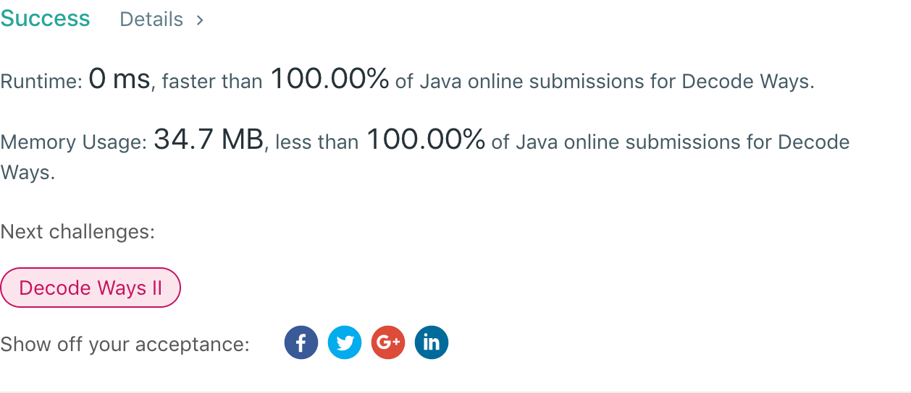

## 91. Decode Ways

## 题目地址
https://leetcode.com/problems/decode-ways/

## 题目描述
```
A message containing letters from A-Z is being encoded to numbers using the following mapping:

'A' -> 1
'B' -> 2
...
'Z' -> 26
Given a non-empty string containing only digits, determine the total number of ways to decode it.

Example 1:

Input: "12"
Output: 2
Explanation: It could be decoded as "AB" (1 2) or "L" (12).
Example 2:

Input: "226"
Output: 3
Explanation: It could be decoded as "BZ" (2 26), "VF" (22 6), or "BBF" (2 2 6).
```


## 代码
* 语言支持：Java

```java
class Solution {
    public int numDecodings(String s) {
        if(s.length() == 0) return 0;
        char[] array = s.toCharArray();
        if(array[0] == '0') return 0;
        int[] end = new int[array.length];
        end[0] = 1;
        for(int i = 1; i < array.length; i++) {
            if(array[i] == '0') {
                if(array[i-1] == '1' || array[i-1] == '2') {
                    if(i > 1) {
                        end[i] = end[i-1] = end[i-2];
                    } else
                        end[i] = end[i-1];
                } else return 0;
            } else {
                if(array[i-1] == '1' || (array[i-1] == '2' && array[i] <= '6')) {
                    end[i] = end[i-1] + (i > 1 ? end[i-2] : 1);
                } else {
                    end[i] = end[i-1];
                }
            }
        }
        return end[array.length - 1];
    }
}
class Solution {
    public int numDecodings(String s) {
        if(s.length() == 0) return 0;
        char[] array = s.toCharArray();
        if(array[0] == '0') return 0;
        int prev = 1, prevPrev = 1;
        for(int i = 1; i < array.length; i++) {
            int tmp = prev;
            if(array[i] == '0') {
                if(array[i-1] == '1' || array[i-1] == '2') {
                    if(i > 1) {
                        prev = prevPrev;
                    }
                } else return 0;
            } else {
                if(array[i-1] == '1' || (array[i-1] == '2' && array[i] <= '6')) {
                    prev += (i > 1 ? prevPrev : 1);
                }
            }
            prevPrev = tmp;
        }
        return prev;
    }
}
```
