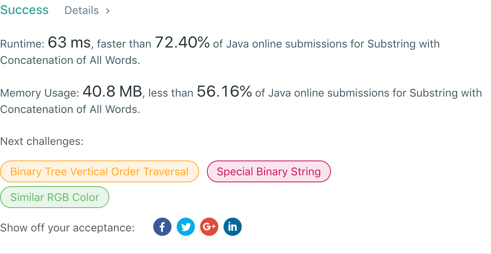

## 30. Substring with Concatenation of All Words

## 题目地址
https://leetcode.com/problems/substring-with-concatenation-of-all-words/

## 题目描述
```

You are given a string, s, and a list of words, words, that are all of the same length. Find all starting indices of substring(s) in s that is a concatenation of each word in words exactly once and without any intervening characters.

Example 1:

Input:
  s = "barfoothefoobarman",
  words = ["foo","bar"]
Output: [0,9]
Explanation: Substrings starting at index 0 and 9 are "barfoor" and "foobar" respectively.
The output order does not matter, returning [9,0] is fine too.
Example 2:

Input:
  s = "wordgoodgoodgoodbestword",
  words = ["word","good","best","word"]
Output: []
```


## 代码
* 语言支持：Java

```java
class Solution {
    public List<Integer> findSubstring(String s, String[] words) {
        if(words.length == 0)
            return Collections.emptyList();
        char[] chars = s.toCharArray();
        List<Integer> result = new ArrayList<>();
        Map<String, Integer> count = new HashMap<>();
        for(String word : words)
            count.put(word, count.getOrDefault(word, 0) + 1);
        int wordLength = words[0].length();
        int length = wordLength * words.length;
        for(int i = 0; i <= chars.length - length; i++) {
            compare(i, i + length - 1, count, wordLength, chars, result);
        }
        return result;
    }

    private void compare(int from, int end, Map<String, Integer> count, int wordLength, char[] chars, List<Integer> result) {
        Map<String, Integer> seen = new HashMap<>();
        for(int i = from; i <= end; i += wordLength) {
            String word = new String(chars, i, wordLength);
            if(!count.containsKey(word))
                return;
            seen.put(word, seen.getOrDefault(word, 0) + 1);
            if(seen.get(word) > count.get(word))
                return;
        }
        result.add(from);
    }
}
```
