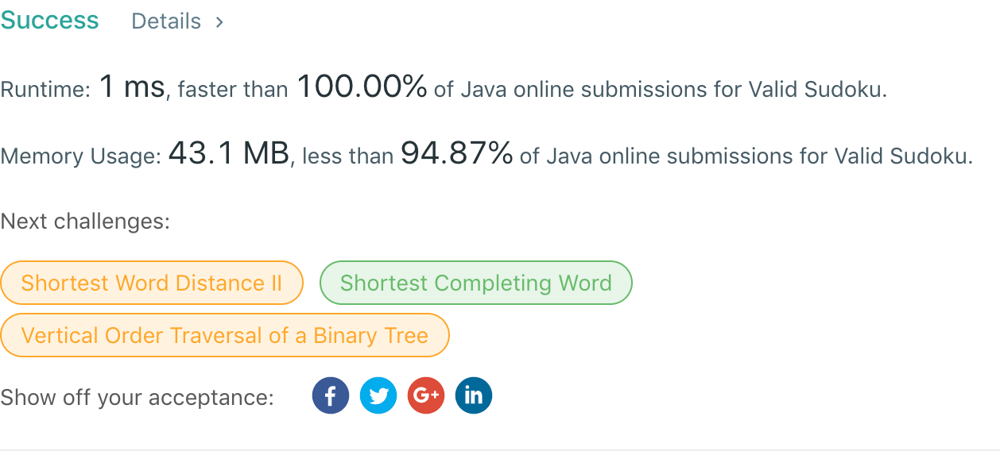

## 36. Valid Sudoku

## 题目地址
https://leetcode.com/problems/valid-sudoku/

## 题目描述
```

Determine if a 9x9 Sudoku board is valid. Only the filled cells need to be validated according to the following rules:

Each row must contain the digits 1-9 without repetition.
Each column must contain the digits 1-9 without repetition.
Each of the 9 3x3 sub-boxes of the grid must contain the digits 1-9 without repetition.

A partially filled sudoku which is valid.

The Sudoku board could be partially filled, where empty cells are filled with the character '.'.

Example 1:

Input:
[
  ["5","3",".",".","7",".",".",".","."],
  ["6",".",".","1","9","5",".",".","."],
  [".","9","8",".",".",".",".","6","."],
  ["8",".",".",".","6",".",".",".","3"],
  ["4",".",".","8",".","3",".",".","1"],
  ["7",".",".",".","2",".",".",".","6"],
  [".","6",".",".",".",".","2","8","."],
  [".",".",".","4","1","9",".",".","5"],
  [".",".",".",".","8",".",".","7","9"]
]
Output: true
Example 2:

Input:
[
  ["8","3",".",".","7",".",".",".","."],
  ["6",".",".","1","9","5",".",".","."],
  [".","9","8",".",".",".",".","6","."],
  ["8",".",".",".","6",".",".",".","3"],
  ["4",".",".","8",".","3",".",".","1"],
  ["7",".",".",".","2",".",".",".","6"],
  [".","6",".",".",".",".","2","8","."],
  [".",".",".","4","1","9",".",".","5"],
  [".",".",".",".","8",".",".","7","9"]
]
Output: false
Explanation: Same as Example 1, except with the 5 in the top left corner being 
    modified to 8. Since there are two 8's in the top left 3x3 sub-box, it is invalid.
Note:

A Sudoku board (partially filled) could be valid but is not necessarily solvable.
Only the filled cells need to be validated according to the mentioned rules.
The given board contain only digits 1-9 and the character '.'.
The given board size is always 9x9.
```


## 代码
* 语言支持：Java

```java
class Solution {
    int[] row = new int[9];
    int[] col = new int[9];
    int[][] block = new int[3][3];
    boolean isValid(int i, int j, int number) {
        return (row[i] >> number & 1) == 0 && (col[j] >> number & 1) == 0 && (block[i/3][j/3] >> number & 1) == 0;
    }
    void setValue(int i, int j, int number) {
        row[i] |= 1 << number;
        col[j] |= 1 << number;
        block[i/3][j/3] |= 1 << number;
    }
    void unSetValue(int i, int j, int number) {
        row[i] &= ~(1 << number);
        col[j] &= ~(1 << number);
        block[i/3][j/3] &= ~(1 << number);
    }


    public boolean isValidSudoku(char[][] board) {
        for(int i = 0; i < 9; i++) {
            for(int j = 0; j < 9; j++) {
                if(board[i][j] != '.') {
                    if(!isValid(i, j, board[i][j] - '0'))
                        return false;
                    setValue(i, j, board[i][j] - '0');
                }
            }
        }
        return true;
    }
}
```
