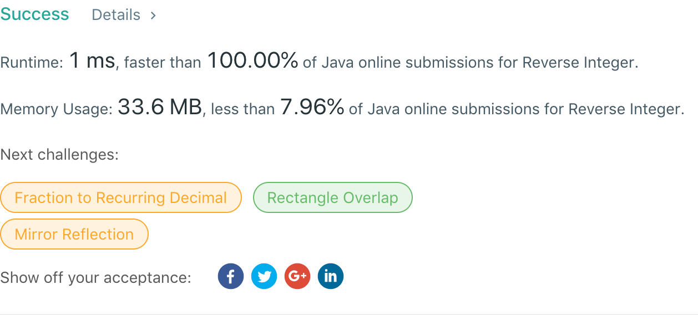

## 7. Reverse Integer

## 题目地址
https://leetcode.com/problems/reverse-integer/

## 题目描述
```
Given a 32-bit signed integer, reverse digits of an integer.

Example 1:

Input: 123
Output: 321
Example 2:

Input: -123
Output: -321
Example 3:

Input: 120
Output: 21
Note:
Assume we are dealing with an environment which could only store integers within the 32-bit signed integer range: [−231,  231 − 1]. For the purpose of this problem, assume that your function returns 0 when the reversed integer overflows.
```


## 代码
* 语言支持：Java

```java
public class Solution {
    public int reverse(int x) {
        int rev = 0;
    	for(; x != 0; x /= 10) {
    		if(rev * 10 / 10 != rev)
    			return 0;
    		rev = rev * 10 + x % 10;
    	}
    	return rev;
    }
}
```
