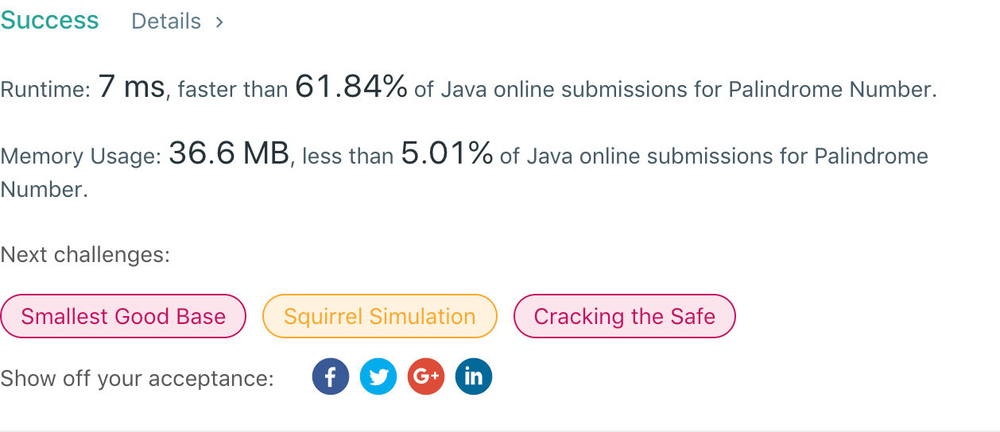

## 9. Palindrome Number

## 题目地址
https://leetcode.com/problems/palindrome-number/

## 题目描述
```
Determine whether an integer is a palindrome. An integer is a palindrome when it reads the same backward as forward.

Example 1:

Input: 121
Output: true
Example 2:

Input: -121
Output: false
Explanation: From left to right, it reads -121. From right to left, it becomes 121-. Therefore it is not a palindrome.
Example 3:

Input: 10
Output: false
Explanation: Reads 01 from right to left. Therefore it is not a palindrome.
```


## 代码
* 语言支持：Java

```java
public class Solution {
    public boolean isPalindrome(int x) {
        if(x < 0) return false;
        int div = 1;
        for(; x / div >= 10; div *= 10);
        do {
            if(x / div != x % 10)
                return false;
            // 掐头去尾
            x = (x % div) / 10;
            div /= 100;
        } while(x > 0);
        return true;
    }
}
```
