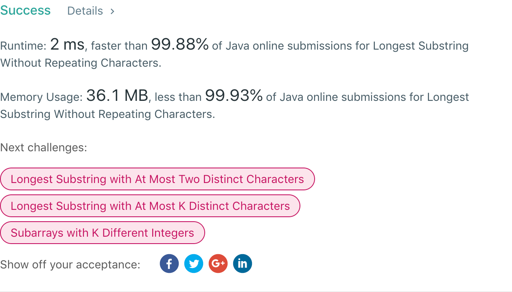

## 3. Longest Substring Without Repeating Characters

## 题目地址
https://leetcode.com/problems/longest-substring-without-repeating-characters/

## 题目描述
```
Given a string, find the length of the longest substring without repeating characters.

Example 1:

Input: "abcabcbb"
Output: 3 
Explanation: The answer is "abc", with the length of 3. 
Example 2:

Input: "bbbbb"
Output: 1
Explanation: The answer is "b", with the length of 1.
Example 3:

Input: "pwwkew"
Output: 3
Explanation: The answer is "wke", with the length of 3. 
             Note that the answer must be a substring, "pwke" is a subsequence and not a substring.

给定一个字符串，请你找出其中不含有重复字符的 最长子串 的长度。

示例 1:

输入: "abcabcbb"
输出: 3 
解释: 因为无重复字符的最长子串是 "abc"，所以其长度为 3。
示例 2:

输入: "bbbbb"
输出: 1
解释: 因为无重复字符的最长子串是 "b"，所以其长度为 1。
示例 3:

输入: "pwwkew"
输出: 3
解释: 因为无重复字符的最长子串是 "wke"，所以其长度为 3。
```


## 代码
* 语言支持：Java

```java
class Solution {
    public int lengthOfLongestSubstring(String s) {
        char[] array = s.toCharArray();
        int[] map = new int[128];
        for(int i = 0; i < 128; i++)
            map[i] = -1;
        int max = 0;
        int i = 0, left = 0, temp = 0;
        for(; i < array.length; i++) {
            if(map[array[i]] != -1) {
                temp = i - left;
                max = max > temp ? max : temp;
                temp = map[array[i]] + 1;
                left = temp > left ? temp : left;
            }
            map[array[i]] = i;
        }
        return max >= i - left ? max : i - left;
    }
}
```
