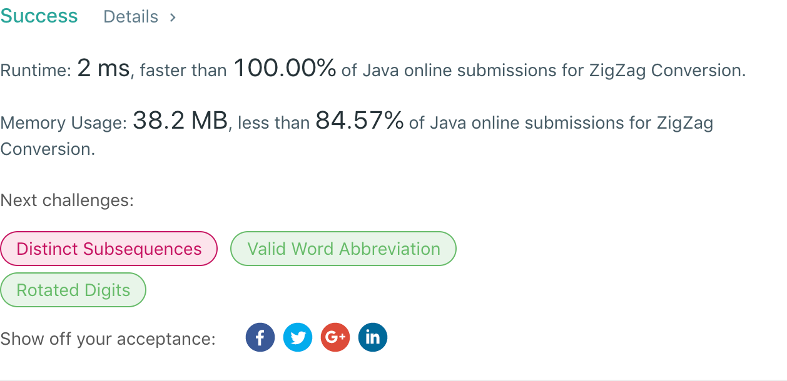

## 6. ZigZag Conversion

## 题目地址
https://leetcode.com/problems/zigzag-conversion/

## 题目描述
```
The string "PAYPALISHIRING" is written in a zigzag pattern on a given number of rows like this: (you may want to display this pattern in a fixed font for better legibility)

P   A   H   N
A P L S I I G
Y   I   R
And then read line by line: "PAHNAPLSIIGYIR"

Write the code that will take a string and make this conversion given a number of rows:

string convert(string s, int numRows);
Example 1:

Input: s = "PAYPALISHIRING", numRows = 3
Output: "PAHNAPLSIIGYIR"
Example 2:

Input: s = "PAYPALISHIRING", numRows = 4
Output: "PINALSIGYAHRPI"
Explanation:

P     I    N
A   L S  I G
Y A   H R
P     I
```


## 代码
* 语言支持：Java

```java
public class Solution {
    public String convert(String s, int numRows) {
        if(numRows == 1)
			return s;
        int interval = 2 * numRows - 2;
        int length = s.length();
        char[] charArray = s.toCharArray();
        StringBuilder sb = new StringBuilder();
        for(int i = 0; i < numRows; i++) {
        	if(i == 0 || i == numRows - 1) {
        		for(int j = i; j < length; j += interval) {
        			sb.append(charArray[j]);
        		}
        	} else {
        		for(int j = i, k = interval - i; j < length;
        				j += interval, k += interval) {
        			sb.append(charArray[j]);
        			if(k < length) {
        				sb.append(charArray[k]);
        			}
        		}
        	}
        }
        return sb.toString();
    }
}
```
