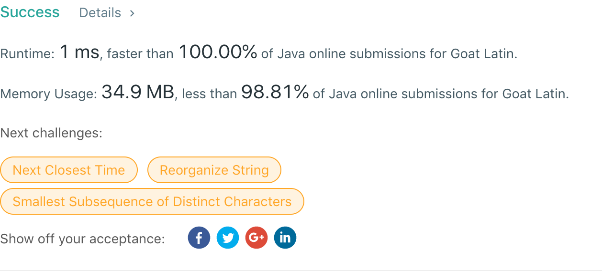

## 824. Goat Latin

## 题目地址
https://leetcode.com/problems/goat-latin/

## 题目描述
```
A sentence S is given, composed of words separated by spaces. Each word consists of lowercase and uppercase letters only.

We would like to convert the sentence to "Goat Latin" (a made-up language similar to Pig Latin.)

The rules of Goat Latin are as follows:

If a word begins with a vowel (a, e, i, o, or u), append "ma" to the end of the word.
For example, the word 'apple' becomes 'applema'.
 
If a word begins with a consonant (i.e. not a vowel), remove the first letter and append it to the end, then add "ma".
For example, the word "goat" becomes "oatgma".
 
Add one letter 'a' to the end of each word per its word index in the sentence, starting with 1.
For example, the first word gets "a" added to the end, the second word gets "aa" added to the end and so on.
Return the final sentence representing the conversion from S to Goat Latin. 
```


## 代码
* 语言支持：Java

```java
class Solution {
    public String toGoatLatin(String s) {
        StringBuilder sb = new StringBuilder();
        char[] chars = s.toCharArray();

        int count = 1;
        char consonant = 'a';
        if (chars[0] != 'a' && chars[0] != 'e' && chars[0] != 'i' && chars[0] != 'o' && chars[0] != 'u' &&
                chars[0] != 'A' && chars[0] != 'E' && chars[0] != 'I' && chars[0] != 'O' && chars[0] != 'U') {
            consonant = chars[0];
        } else
            sb.append(chars[0]);
        for (int i = 1; i <= chars.length; i++) {
            if (i == chars.length || chars[i] == ' ') {
                if (consonant != 'a') {
                    sb.append(consonant);
                }
                sb.append('m');
                for (int j = 0; j <= count; j++)
                    sb.append('a');
                ++count;
                if (i + 1 < chars.length) {
                    switch (chars[i + 1]) {
                        case 'a':
                        case 'e':
                        case 'i':
                        case 'o':
                        case 'u':
                        case 'A':
                        case 'E':
                        case 'I':
                        case 'O':
                        case 'U':
                            consonant = 'a';
                            break;
                        default:
                            consonant = chars[++i];
                    }
                    sb.append(' ');
                }
            } else {
                sb.append(chars[i]);
            }
        }
        return sb.toString();
    }
}
```
