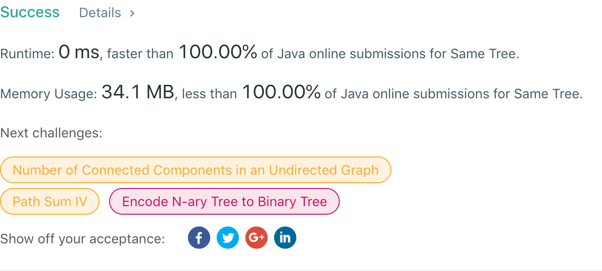

## 101. Symmetric Tree

## 题目地址
https://leetcode.com/problems/symmetric-tree/

## 题目描述
```
Given two binary trees, write a function to check if they are the same or not.

Two binary trees are considered the same if they are structurally identical and the nodes have the same value.

Example 1:

Input:     1         1
          / \       / \
         2   3     2   3

        [1,2,3],   [1,2,3]

Output: true
Example 2:

Input:     1         1
          /           \
         2             2

        [1,2],     [1,null,2]

Output: false
Example 3:

Input:     1         1
          / \       / \
         2   1     1   2

        [1,2,1],   [1,1,2]

Output: false
```


## 代码
* 语言支持：Java

```java
/**
 * Definition for a binary tree node.
 * public class TreeNode {
 *     int val;
 *     TreeNode left;
 *     TreeNode right;
 *     TreeNode(int x) { val = x; }
 * }
 */
public class Solution {
    public boolean isSameTree(TreeNode p, TreeNode q) {
        return traverse(p, q);
    }
    private boolean traverse(TreeNode p, TreeNode q) {
		if(p == q)
			return true;
		// 有一项不为空
		if(p == null || q == null)
			return false;
		if(p.val == q.val)
			return traverse(p.left, q.left) && traverse(p.right, q.right);
		return false;
	}
}
```
