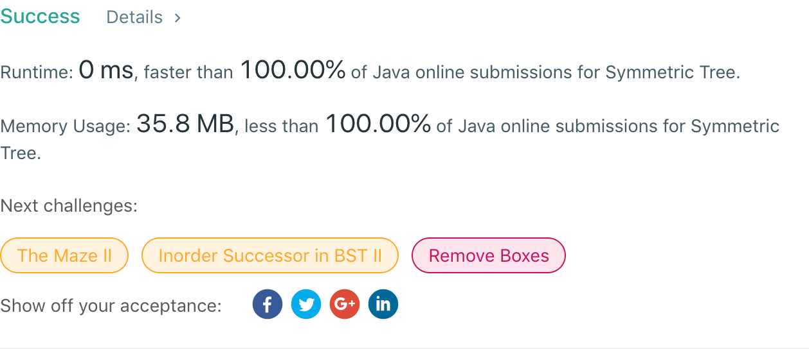

## 101. Symmetric Tree

## 题目地址
https://leetcode.com/problems/symmetric-tree/

## 题目描述
```
Given a binary tree, check whether it is a mirror of itself (ie, symmetric around its center).

For example, this binary tree [1,2,2,3,4,4,3] is symmetric:

    1
   / \
  2   2
 / \ / \
3  4 4  3
 

But the following [1,2,2,null,3,null,3] is not:

    1
   / \
  2   2
   \   \
   3    3
 

Note:
Bonus points if you could solve it both recursively and iteratively.
```


## 代码
* 语言支持：Java

```java
/**
 * Definition for a binary tree node.
 * public class TreeNode {
 *     int val;
 *     TreeNode left;
 *     TreeNode right;
 *     TreeNode(int x) { val = x; }
 * }
 */
public class Solution {
    public boolean isSymmetric(TreeNode root) {
        if(root == null)
            return true;
        return traverse(root.left, root.right);
    }
	private boolean traverse(TreeNode node1, TreeNode node2) {
		if(node1 == null && node2 == null)
			return true;
		if(node1 == null || node2 == null || node1.val != node2.val)
			return false;
		return traverse(node1.left, node2.right) && traverse(node1.right, node2.left);
	}
}
```
