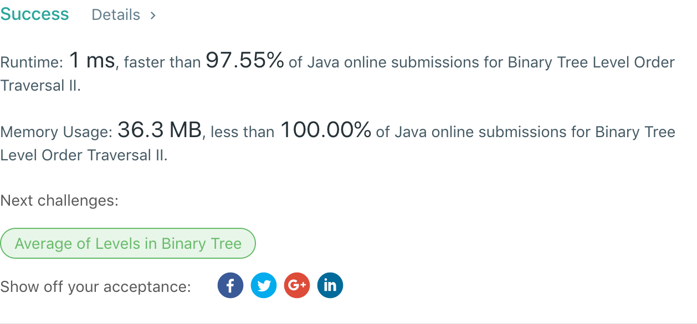

## 107. Binary Tree Level Order Traversal II

## 题目地址
https://leetcode.com/problems/binary-tree-level-order-traversal-ii/

## 题目描述
```
Given a binary tree, return the bottom-up level order traversal of its nodes' values. (ie, from left to right, level by level from leaf to root).

For example:
Given binary tree [3,9,20,null,null,15,7],
    3
   / \
  9  20
    /  \
   15   7
return its bottom-up level order traversal as:
[
  [15,7],
  [9,20],
  [3]
]
```


## 代码
* 语言支持：Java

```java
/**
 * Definition for a binary tree node.
 * public class TreeNode {
 *     int val;
 *     TreeNode left;
 *     TreeNode right;
 *     TreeNode(int x) { val = x; }
 * }
 */
public class Solution {
    public List<List<Integer>> levelOrderBottom(TreeNode root) {
		List<List<Integer>> result = new ArrayList<>();
        if(root == null) return result;
		Queue<TreeNode> queue = new LinkedList<>();
		queue.add(root);
		Collections.reverse(traverse(queue, result));
		return result; 
    }
    private List<List<Integer>> traverse(Queue<TreeNode> queue, List<List<Integer>> result) {
		TreeNode node = null;
		Queue<TreeNode> newQueue = new LinkedList<>();
		List<Integer> row = new ArrayList<>();
		while(!queue.isEmpty()) {
			node = queue.poll();
			row.add(node.val);
			if(node.left != null) newQueue.offer(node.left);
			if(node.right != null) newQueue.offer(node.right);
		}
		result.add(row);
		if(newQueue.isEmpty()) return result;
		return traverse(newQueue, result);
	}
}
```
