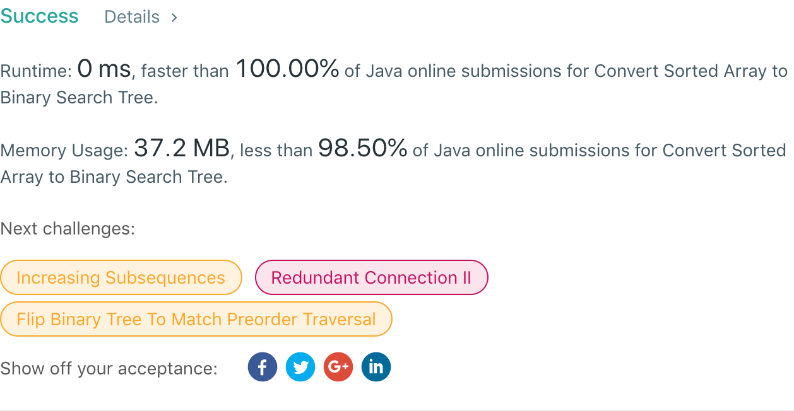

## 108. Convert Sorted Array to Binary Search Tree

## 题目地址
https://leetcode.com/problems/convert-sorted-array-to-binary-search-tree/

## 题目描述
```
Given an array where elements are sorted in ascending order, convert it to a height balanced BST.

For this problem, a height-balanced binary tree is defined as a binary tree in which the depth of the two subtrees of every node never differ by more than 1.

Example:

Given the sorted array: [-10,-3,0,5,9],

One possible answer is: [0,-3,9,-10,null,5], which represents the following height balanced BST:

      0
     / \
   -3   9
   /   /
 -10  5
```


## 代码
* 语言支持：Java

```java
/**
 * Definition for a binary tree node.
 * public class TreeNode {
 *     int val;
 *     TreeNode left;
 *     TreeNode right;
 *     TreeNode(int x) { val = x; }
 * }
 */
public class Solution {
    public TreeNode sortedArrayToBST(int[] nums) {
        return sortedArrayToBST(nums, 0, nums.length - 1);
    }
	
	private TreeNode sortedArrayToBST(int[] nums, int lo, int hi) {
		if(lo > hi) return null;
		int mid = (lo + hi) / 2;
		TreeNode root = new TreeNode(nums[mid]);
		root.left = sortedArrayToBST(nums, lo, mid - 1);
		root.right = sortedArrayToBST(nums, mid + 1, hi);
		return root;
	}
}
```
