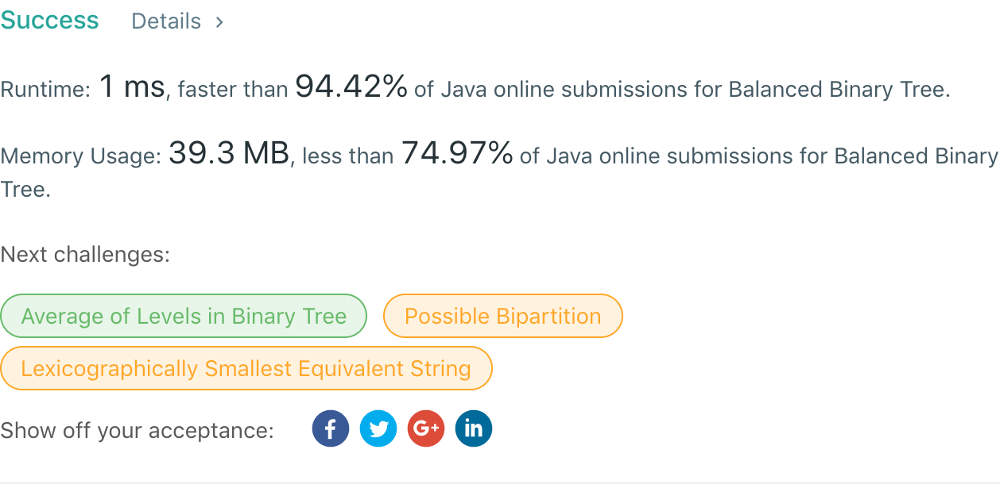

## 110. Balanced Binary Tree

## 题目地址
https://leetcode.com/problems/balanced-binary-tree/

## 题目描述
```
Given a binary tree, determine if it is height-balanced.

For this problem, a height-balanced binary tree is defined as:

a binary tree in which the depth of the two subtrees of every node never differ by more than 1.

Example 1:

Given the following tree [3,9,20,null,null,15,7]:

    3
   / \
  9  20
    /  \
   15   7
Return true.

Example 2:

Given the following tree [1,2,2,3,3,null,null,4,4]:

       1
      / \
     2   2
    / \
   3   3
  / \
 4   4
Return false.
```


## 代码
* 语言支持：Java

```java
/**
 * Definition for a binary tree node.
 * public class TreeNode {
 *     int val;
 *     TreeNode left;
 *     TreeNode right;
 *     TreeNode(int x) { val = x; }
 * }
 */
public class Solution {
    public boolean isBalanced(TreeNode root) {
        if(degree(root) == -1) return false;
        return true;
    }
	
	private int degree(TreeNode node) {
		if(node == null) return 0;
		int left = degree(node.left);
		if(left == -1) return -1;
		int right = degree(node.right);
		if(right == -1) return -1;
		if(Math.abs(left - right) > 1) return -1;
		return Math.max(left, right) + 1;
	}
}
```
