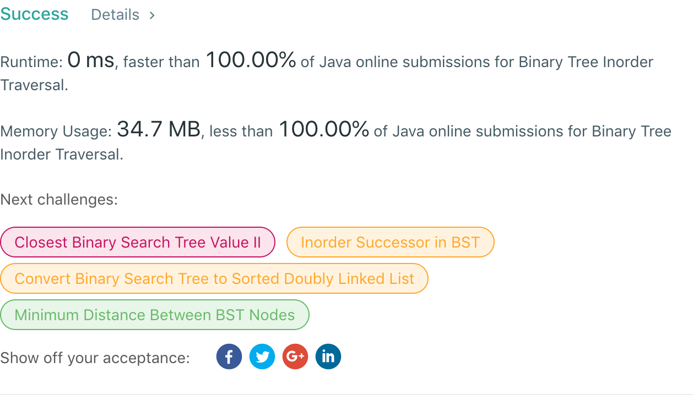

## 94. Binary Tree Inorder Traversal

## 题目地址
https://leetcode.com/problems/binary-tree-inorder-traversal/

## 题目描述
```
Given a binary tree, return the inorder traversal of its nodes' values.

Example:

Input: [1,null,2,3]
   1
    \
     2
    /
   3

Output: [1,3,2]
Follow up: Recursive solution is trivial, could you do it iteratively?
```


## 代码
* 语言支持：Java

```java
/**
 * Definition for a binary tree node.
 * public class TreeNode {
 *     int val;
 *     TreeNode left;
 *     TreeNode right;
 *     TreeNode(int x) { val = x; }
 * }
 */
public class Solution {
    public static List<Integer> inorderTraversal(TreeNode root) {
        List<Integer> result = new ArrayList<>();
        traverse(root, result);
        return result;
    }
	private static void traverse(TreeNode node, List<Integer> result) {
		if(node != null) {
			traverse(node.left, result);
			result.add(node.val);
			traverse(node.right, result);
		}
	}
}
```
