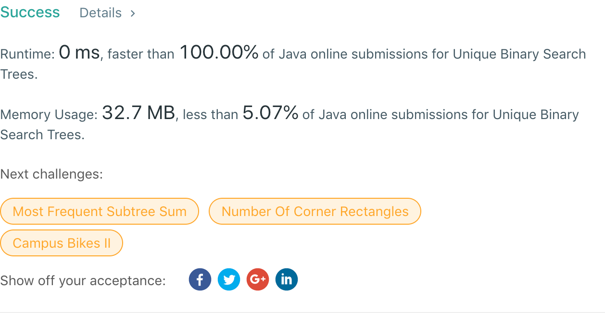

## 96. Unique Binary Search Trees

## 题目地址
https://leetcode.com/problems/unique-binary-search-trees/

## 题目描述
```
Given n, how many structurally unique BST's (binary search trees) that store values 1 ... n?

Example:

Input: 3
Output: 5
Explanation:
Given n = 3, there are a total of 5 unique BST's:

   1         3     3      2      1
    \       /     /      / \      \
     3     2     1      1   3      2
    /     /       \                 \
   2     1         2                 3
```


## 代码
* 语言支持：Java

```java
class Solution {
    public int numTrees(int n) {
        int[] result = new int[n + 1];
        result[0] = 1;
        for(int i = 1; i < n; i++) {
            result[i] = 2 * result[i-1];
            for(int j = 0; j < i - 1; j++) {
                result[i] += result[j] * result[i-2-j];
            }
        }
        return result[n-1];
    }
}
```
