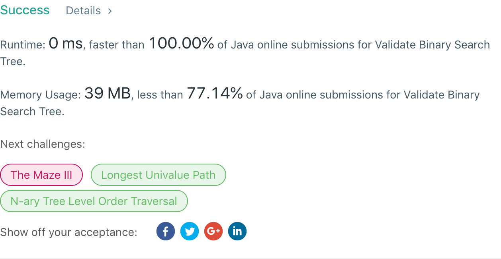

## 98. Validate Binary Search Tree

## 题目地址
https://leetcode.com/problems/validate-binary-search-tree/

## 题目描述
```
Given a binary tree, determine if it is a valid binary search tree (BST).

Assume a BST is defined as follows:

The left subtree of a node contains only nodes with keys less than the node's key.
The right subtree of a node contains only nodes with keys greater than the node's key.
Both the left and right subtrees must also be binary search trees.
 

Example 1:

    2
   / \
  1   3

Input: [2,1,3]
Output: true
Example 2:

    5
   / \
  1   4
     / \
    3   6

Input: [5,1,4,null,null,3,6]
Output: false
Explanation: The root node's value is 5 but its right child's value is 4.
```


## 代码
* 语言支持：Java

```java
/**
 * Definition for a binary tree node.
 * public class TreeNode {
 *     int val;
 *     TreeNode left;
 *     TreeNode right;
 *     TreeNode(int x) { val = x; }
 * }
 */
public class Solution {
    public boolean isValidBST(TreeNode root) {
        if(root == null) return true;
        return recursive(root.left, Long.MIN_VALUE, root.val) && recursive(root.right, root.val, Long.MAX_VALUE);
    }
    private boolean recursive(TreeNode node, long min, long max) {
        if(node == null) return true;
        if(node.val >= max || node.val <= min) return false;
        return recursive(node.left, min, node.val) && recursive(node.right, node.val, max);
    }
}
```
