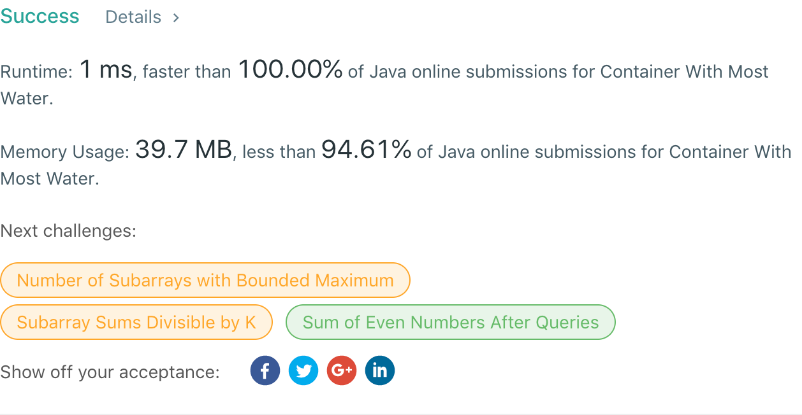

## 11. Container With Most Water

## 题目地址
https://leetcode.com/problems/container-with-most-water/

## 题目描述
```
Given n non-negative integers a1, a2, ..., an , where each represents a point at coordinate (i, ai). n vertical lines are drawn such that the two endpoints of line i is at (i, ai) and (i, 0). Find two lines, which together with x-axis forms a container, such that the container contains the most water.

Note: You may not slant the container and n is at least 2.

 


The above vertical lines are represented by array [1,8,6,2,5,4,8,3,7]. In this case, the max area of water (blue section) the container can contain is 49.

 

Example:

Input: [1,8,6,2,5,4,8,3,7]
Output: 49
```


## 代码
* 语言支持：Java

```java
public class Solution {
    public int maxArea(int[] height) {
        int maxArea = 0;
		int max = 0;
		for(int i = 0; i < height.length-1; i++) {
			if(height[i] > max) {
				max = height[i];
				for(int j = height.length - 1; j > i; j--) {
					if(maxArea >= height[i] * (j - i))
						break;
					int minHeight = height[i] < height[j] ? height[i] : height[j];
					maxArea = maxArea < minHeight * (j - i) ? minHeight * (j - i) : maxArea;
				}
			}
		}
        return maxArea;
    }
}
```
